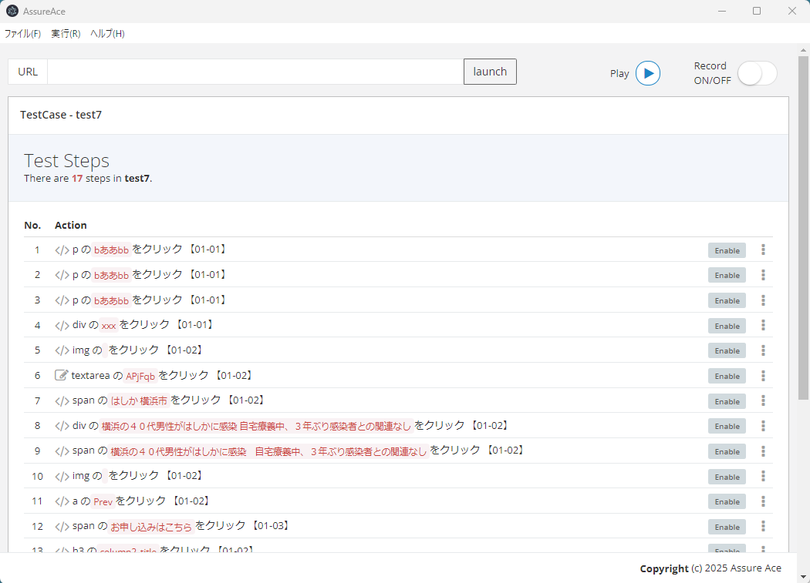
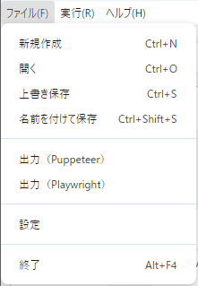
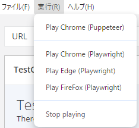

# assure-ace

This package is an Electron application that records and replays browser interactions, making it suitable for E2E testing and RPA automation.
All operations—including recording, editing, and playback—can be performed through a window-based control panel, enabling a fully **no-code** workflow.

## Introduction

Traditional recorders have typically used CSS selectors to capture browser interactions.
However, CSS selectors are fragile when UI layouts change. For example, in the context of E2E test scripts for web systems, it's often necessary to re-record actions each time the system undergoes a version upgrade.

This recorder addresses that issue by generating **text-based selectors** instead of relying on conventional CSS selectors.
These selectors are less affected by layout changes, thereby reducing the need for re-recording.
Even if the text content changes, it can be easily modified directly from the application interface.

Designed with test script automation in mind, this recorder also analyzes form structures and input content to generate selectors with appropriate hierarchical structure.

This recorder also offers several advantages over traditional tools:

- Record and replay actions across multiple windows and tabs
- Export scripts compatible with **Puppeteer** and **Playwright**
- Support for multiple browsers during playback (**Google Chrome**, **Edge**, and **Firefox**)
- No-code editing and deletion of recorded steps
- Ability to pause and resume playback at any time

## Installation

In the future, we plan to support app packaging using tools such as webpack and electron-builder.

```bash
npm install
```

## Usage

To launch the application:

```bash
npm run start
```



### How to Use the Application

### Recording Browser Operations
1. Click the `c)` button to enable recording mode.
2 Enter the target URL in the `a)` input field and click `launch`.
3. A browser window will open and display the specified URL.
4. Your actions in the browser will be automatically recorded and shown in the `d)` operation log panel.
5. Once recording is complete, click the `c)` button again to disable recording mode.

### Saving Recorded Operations
Open the File menu and select “Save As” to save the recorded actions as a `.ace` file.



### Exporting as a Script
To export the recorded operations as a **Puppeteer** or **Playwright** script, select “Export” from the menu.
Please run the exported script in your own Puppeteer or Playwright environment.
This application does not support script execution or editing.

### Loading Operation Logs
1. Open the File menu and select “Open”.
2. Choose a previously saved `.ace` file.
3. The operation log will be displayed in the `d)` log panel.

### Replaying Browser Operations
1. With the operation log displayed in `d)`, click the `b)` button.
2. A browser will automatically launch and replay the recorded operations.

By default, the replay uses **Chromium from Puppeteer**.
To switch to Playwright, use the execution menu.
To change the default browser used during playback, go to “Settings” in the File menu.



### Editing Operation Logs
Click the “...” button on the right side of each log entry and select “Edit”.


An edit window will appear. Make changes as needed.


## Notes

### Known Issues

This application is currently under development, and the following issues are pending:

- Playback functionality for operation logs has not yet been implemented
- Support for selecting multiple selector attributes is not yet available
- Editing steps such as `Sleep` and screenshots is not yet supported

## License

This project is licensed under the MIT License, with the Commons Clause restriction.

See [LICENSE](./LICENSE) for details.
