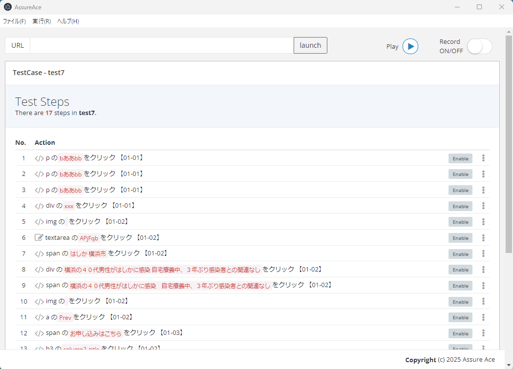
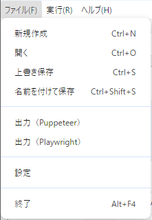
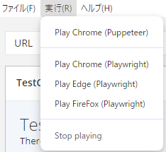
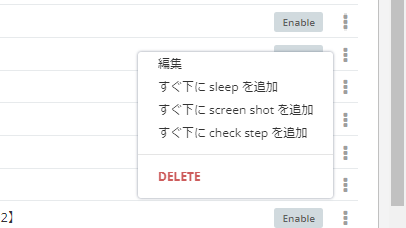
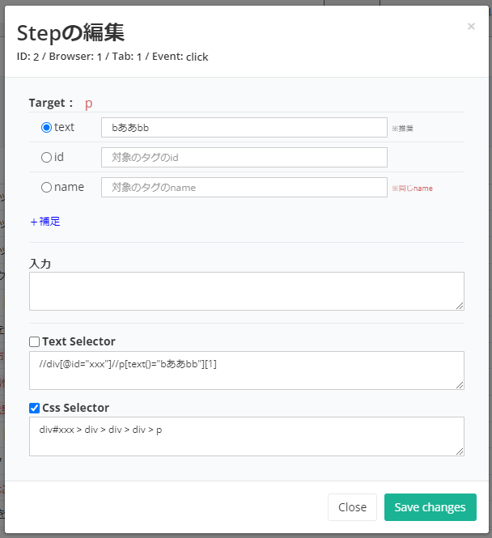

# assure-ace

このパッケージはブラウザ操作の記録と再現を行うことで、E2E テストや RPA に活用できる Electron アプリケーションです。  
操作の記録、編集、再生はすべてウィンドウ上のパネルから実行でき、あらゆる手順を**ノーコード**で扱うことが可能です。

## Introduction

従来のレコーダーでは、ブラウザ操作の記録には CSS セレクターが用いられてきました。  
しかし、CSS セレクターは画面レイアウトの変更に弱く、たとえば Web システムの E2E テストスクリプトでは、システムのリビジョンアップごとに再度記録し直す必要が生じがちです。

本レコーダーでは、従来の CSS セレクターの代わりに**テキストベースのセレクター**を生成することで、レイアウト変更の影響を受けにくくし、再記録のリスクを軽減します。  
テキスト内容に変更があった場合でも、アプリ画面上から文言を直接編集することが可能です。

また、テストスクリプトとしての活用を前提に、フォーム構造や入力内容を解析し、適切な階層構造を持つセレクターを自動的に生成する設計となっています。

本レコーダーは、以下の点でも従来型のレコーダーより優れた機能を備えています：

- 複数ウィンドウやタブの操作を記録・再現
- **Puppeteer** および **Playwright** のスクリプト出力に対応
- 再現対象ブラウザの複数対応（**Google Chrome**、**Edge**、**Firefox**）
- ノーコードでの操作手順の編集・削除が可能
- 再生の一時停止・再開機能を搭載

## Installation

将来的には webpack や electron-builder 等によるアプリのパッケージングを想定しています。

```bash
npm install
```

## Usage

アプリケーションの起動：

```bash
npm run start
```



### アプリケーションの操作方法

### ブラウザ操作の記録
1. `c)` ボタンをクリックして、記録モードを有効にします。  
2. `a)` の入力欄に目的の URL を入力し、`launch` をクリックします。  
3. ブラウザが起動し、指定された URL の画面が表示されます。  
4. ブラウザ上での操作が自動的に記録され、`d)` の操作ログパネルに表示されます。  
5. 操作が完了したら、`c)` を再度クリックして記録モードを終了します。

### ブラウザ操作の保存
ファイルメニューから「名前を付けて保存」を選択し、操作内容を `.ace` 拡張子のファイルとして保存します。



### スクリプトとして出力
操作ログを Puppeteer または Playwright のスクリプトとして出力するには、メニューから「出力」を選択します。  
出力されたスクリプトは、**Puppeteer 環境または Playwright 環境**で実行してください。  
本アプリケーション上では、スクリプトの実行や編集は行えません。

### 操作ログの読み込み
1. ファイルメニューから「開く」を選択します。  
2. `.ace` 拡張子の保存済みファイルを選択します。  
3. 操作ログが `d)` のログパネルに表示されます。

### ブラウザ操作の再現（再生）
1. `d)` に操作ログが表示されている状態で、`b)` ボタンをクリックします。  
2. 自動的にブラウザが起動し、記録された操作が再現されます。  

初期設定では、**Puppeteer の Chromium** により実行されます。  
Playwright を使用する場合は、実行メニューからブラウザを切り替えてください。  
再生時に使用するブラウザを変更したい場合は、ファイルメニューの「設定」から選択可能です。



### 操作ログの編集
各操作ログの右端にある「…」ボタンをクリックし、「編集」を選択します。



編集ウィンドウが表示されるので、内容を必要に応じて修正してください。



## Notes

### 課題

本アプリケーションは開発中であり、、以下の課題があります。

- 操作ログの再現（プレイバック）機能が未実装  
- セレクタ属性を複数条件で選択する機能の追加  
- `Sleep` やスクリーンショットのステップ編集機能の未対応

## License

This project is licensed under the MIT License, with the Commons Clause restriction.

See [LICENSE](./LICENSE) for details.
